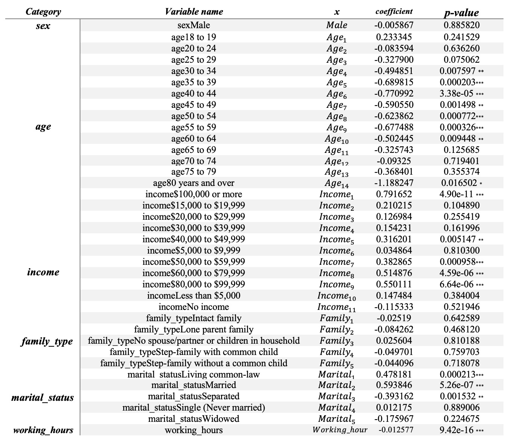

```{r setup, include=FALSE}
knitr::opts_chunk$set(echo = TRUE)
library(tidyverse)
library(janitor)
```

# Abstract

  It could be a severe social problem if high pressure from work lowers people’s life quality to a significant level. Obtained data from the twenty-four cycle of the General Social Survey in Canada, Time Stress and Well Being, this paper analyses the relationship between working hours and people’s life satisfaction. We find that people with longer worker hours are less satisfied with life after controlling for sex, age, income, family type and marital status, and people in different demographic groups have different life satisfaction level. The study appeals to governments intending to increase social well-being, and those with the interest in relationship among life satisfaction, working load and other demographic attributes. 


# Introduction

Nowadays, people are living a fast-paced life under pressure and fierce competition, and it is frustrating that heavy working load in society sometimes presses people to depression. Accumulated interest in and set the goal to find out how working load would influence people’s life quality, we conducted a study on the relationship between working hours and people’s life satisfaction. 

We used the data collected for Time Stress and Well Being from Cycle 24 of the General Social Survey(GSS) to find how working length impacts people’s attitudes to life. After overviewing the distribution of the working hours and life satisfaction separately across Canada, a simple linear regression model of life satisfaction on working hours was conducted. Taking some potential lurking variables into consideration, we conducted a multiple linear regression model of life satisfaction on working hours later, holding demographic variables including sex, age, income, family type and marital status constant. Based on the models, we concluded that controlling for other variables, people who work longer hours per week are less satisfied with life in Canada. Also, from the model results, we found different demographic groups including age and income have different satisfaction level towards life. 

The results of our study could provide insights for policy makers with intention to solve social problems and improve social well-being such as decreasing suicide rates. Also, this would provide supporting evidence for those who maintain different demographic groups have different life satisfication and gives some directions to those who want to increase life quality. People finding jobs could see this study as an indicator for them to choose their working length in accordance with their expected quality of life quality as well. 

Limitations of the study include high non-response rate and the undercoverage problem and limitations for our model contain the model selection and assumption violations. Next steps of would focus on the improvements of those limitations. More detailed information related to our study is discussed in the following part. 
  

# Data

The data we obtained were collected from the twenty-four cycle(Cycle 24) of GSS, Time Stress and Well Being, which was conducted from January to December 2010 for the purpose of collecting data on time use. The target population were all people no younger than 15 years old in Canada except residents of the Yukon, Northwest Territories, and Nunavut and full-time residents of institutions. 

The sample frame was all possible 10-digit phone numbers based on the area codes and 3-digit prefixes currently in use after the elimination the non-working banks, and the lists of telephone numbers in use were purchased from the telephone companies for each province in Canada.  

The survey was conducted through Stratified Simple Random Sampling and generally Random Digit Dialing method(RDD) was used with Computer assisted telephone interviewing(CATI). According to geographic areas, the ten provinces in Canada were grouped into 27 strata. The purchased lists of phone numbers in use were classified as working banks and each working bank was assigned to a strata within its province. In each strata, a simple random sample with replacement of banks from the sample frame was conducted and then the last two digits for each bank were generated randomly to form the complete telephone number. Hence, in this process, a simple random sample without replacement of telephone numbers was achieved. 

The overall target sample size was 22,000 and the final sample size of respondents was 15,390. To make sure an acceptable low sampling variability in each strata, minimum sample sizes were determined for each province.

### Data Features and Strengths

+ Data Accuracy:
For selecting respondents and collecting data, a household roster has been created. This makes the demographic information of respondents become more accurate. Since this survey’s contents are largely based on demographic information, there will be less biases due to the household roster.

+ Time Use Diary:
Except for only answering their time usage on various activities, respondents are also required to provide a diary list of 24-hour time allocation. It can estimate how people use their time more efficiently and accurately. 

+ Broad types of related factors collected:
GSS-24 has collected as many kinds of demographic information that can affect personal well-being as possible. Besides basic information on gender, age, education, family types, household income and time usage. The survey also includes factors such as transportation, cultural activities, sports participation, religion and language, which can provide a more detailed graph of respondents’ demographic background and can also better help us analyze Canadian people’s well-being.

### Data Weakness

+ Non-sampling error:

1. Imperfect coverage: 
The GSS-24 sample’s coverage rates were lowest among low-income households. Therefore, the data under-presented this demographic group of households.
The sampling frame only included those with telephones, excluding those who did not have phone service(estimated at 1.1% - (Residential Telephone Services Survey (RTSS), 2010)) and those who merely used cellular telephone service(estimated at 13% - (Residential Telephone Services Survey (RTSS), 2010)) . Hence, about 14.1% of our target population were out of our coverage range in the sampling frame, and this made our sample data less representative of our target population. 

2. Non-response: GSS-24 sample’s non-response rate was generally 45%, which was higher than previous GSS-19 sample. Since we know few about the non-respond cases, there would be some biases including in the data.

For eliminating the effect of non-responses, they didn’t adjust it but chose to make an assumption that the non-responses cases will have the same distribution as those who have answered. 


+ Sampling error:
Sampling error is unavoidable. The results will vary from sample to sample. It will surely be different from the results of the census.


### Questionare

+ Good points:

1. Design questions to double check and make sure the information is correct: This is especially reflected in the household roster part that it asks different family members with the other households’ members’ identity to make sure the accuracy of demographic background of respondents. Also, since this survey select samples of people over 15, the design of question on age is not a single question but firstly ask for birthday then ask for age, and determine the age of respondents together for eliminating errors.

2. The exhaustiveness of questions: The topics and information covered by the questionare are intact. The questions are designed to show details on each demographic factor. In this case, the information collected can better used on analysis.

3. Clear instructions: The instructions of questions are designed to be short, clear and specific. For parts like time use diary, the questionare even gives examples to make sure the quality of response.

+ Bad points:

1. For some questions, definitions in wording were unclear so that people were answering according to their own understandings.  In these cases, there might be, for example, for physical activities, different people may have different definitions of “physical”, so there might be biases caused by the different interpretations of questions between different people.

2. The questionnaire length is too long. Although the survey is through telephone, there are too many questions for even one module. Also, the process of household rostering before the survey starts is also a little complicated, though it can increase the data accuracy. Overall, the complication of questionnaires is one of the factors that causes the high non-response rate.

### Trade off

Trade off between the exhaustive of data and non-response: One of the advantages for this survey is its comprehensiveness with various questions on large amount of different factors that may affect people’s well being. However, the exhaustiveness also makes the questionare complex, which leads to a relatively high non-response rate of 45%.  We know that both non-response and survey details matter for the data accuracy. The GSS-24 actually has sacrificed reponse rate to some extent for the comprehensiveness of survey in this trade off.

### Cost

There is no disclosed exact number of costs for obtaining this survey data. From the description of survey process, There should be the following costs:

+ Cost on purchasing telephone number list: Approximately $995

+ Cost on labour: The survey lasts from January to December 2010. The estimated cost of labour for abour 4 people: $370,368

+ Approximate total cost: $371,363

```{r, include=FALSE}

# data loading and cleaning process 
raw_data <- read_csv("AAGCUxER.csv")
dict <- read_lines("gss_dict.txt", skip = 18) # skip is because of preamble content
# Now we need the labels because these are the actual responses that we need
labels_raw <- read_file("gss_labels.txt")

#### Set-up the dictionary ####
# What we want is a variable name and a variable definition
variable_descriptions <- as_tibble(dict) %>% 
  filter(value!="}") %>% 
  mutate(value = str_replace(value, ".+%[0-9].*f[ ]{2,}", "")) %>% 
  mutate(value = str_remove_all(value, "\"")) %>% 
  rename(variable_description = value) %>% 
  bind_cols(tibble(variable_name = colnames(raw_data)[-1]))
 
# Now we want a variable name and the possible values
labels_raw_tibble <- as_tibble(str_split(labels_raw, ";")[[1]]) %>% 
  filter(row_number()!=1) %>% 
  mutate(value = str_remove(value, "\nlabel define ")) %>% 
  mutate(value = str_replace(value, "[ ]{2,}", "XXX")) %>% 
  mutate(splits = str_split(value, "XXX")) %>% 
  rowwise() %>% 
  mutate(variable_name = splits[1], cases = splits[2]) %>% 
  mutate(cases = str_replace_all(cases, "\n [ ]{2,}", "")) %>%
  select(variable_name, cases) %>% 
  drop_na()

# Now we have the variable name and the different options e.g. age and 0-9, 10-19, etc.
labels_raw_tibble <- labels_raw_tibble %>% 
  mutate(splits = str_split(cases, "[ ]{0,}\"[ ]{0,}"))

# The function sets up the regex (I know, I know, but eh: https://xkcd.com/208/)
add_cw_text <- function(x, y){
  if(!is.na(as.numeric(x))){
    x_new <- paste0(y, "==", x,"~")
  }
  else{
    x_new <- paste0("\"",x,"\",")
  }
  return(x_new)
}

# The function will be in the row, but it'll get the job done
cw_statements <- labels_raw_tibble %>% 
  rowwise() %>% 
  mutate(splits_with_cw_text = list(modify(splits, add_cw_text, y = variable_name))) %>% 
  mutate(cw_statement = paste(splits_with_cw_text, collapse = "")) %>% 
  mutate(cw_statement = paste0("case_when(", cw_statement,"TRUE~\"NA\")")) %>% 
  mutate(cw_statement = str_replace(cw_statement, ",\"\",",",")) %>% 
  select(variable_name, cw_statement)
# So for every variable we now have a case_when() statement that will convert 
# from the number to the actual response.

# Just do some finally cleanup of the regex.
cw_statements <- 
  cw_statements %>% 
  mutate(variable_name = str_remove_all(variable_name, "\\r")) %>% 
  mutate(cw_statement = str_remove_all(cw_statement, "\\r"))


#### Apply that dictionary to the raw data ####
# Pull out a bunch of variables and then apply the case when statement for the categorical variables
gss <- raw_data %>% 
  select(CASEID, 
         sex,
         agegr5,
         incm,
         marstat,
         famtype,
         prv,
         wkwehr_c,
         lsr_q100) %>% 
  mutate_at(vars(sex:lsr_q100), .funs = funs(ifelse(.>=96, NA, .))) %>% 
  mutate_at(.vars = vars(sex:prv),
            .funs = funs(eval(parse(text = cw_statements %>%
                                      filter(variable_name==deparse(substitute(.))) %>%
                                      select(cw_statement) %>%
                                      pull()))))
# Fix the names
gss <- gss %>% 
  clean_names() %>% 
  rename(age = agegr5,
         income = incm,
         marital_status = marstat,
         family_type = famtype,
         province = prv,
         working_hours = wkwehr_c,
         satisfaction_level = lsr_q100
         ) 

# Omit responses with NA in it
gss[gss=="NA"|gss=="Don't know"|gss == "Not stated"]<-NA
gss<-na.omit(gss)


# Set all categorical variable as factor
gss$sex<-as.factor(gss$sex)
gss$age<-as.factor(gss$age)
gss$income<-as.factor(gss$income)
gss$province<-as.factor(gss$province)
gss$family_type<-as.factor(gss$family_type)
gss$marital_status<-as.factor(gss$marital_status)

# Stratified Sampling Method in each province, the size number is based on the population census of each province in 2019, 

gss$sp<-ifelse(gss$province=="Newfoundland and Labrador",523790,
                ifelse(gss$province=="Prince Edward Island",154748,
                       ifelse(gss$province=="Nova Scotia",965382,
                              ifelse(gss$province=="New Brunswick",772094,
                                     ifelse(gss$province=="Quebec",8433301,
                                            ifelse(gss$province=="Ontario",14446515,
                                                   ifelse(gss$province=="Manitoba",1360396,
                                                          ifelse(gss$province=="Saskatchewan",1168423,
                                              ifelse(gss$province=="Alberta",4345737,
                                                     ifelse(gss$province=="British Columbia",	5020302,0
                                                                                  ))))))))))
```

# Model

To begin with, we firstly build a linear regression model in R to predict life satisfaction level(1 as the least satisfied and 10 as the most satisfied) using weekly working hours. Linear regression models could be understood as a line that describes the effect of weekly working hours to life satisfaction level. The first model we build contains merely weekly working hours as an explanatory variable, since this is the core factor we would like to explore. Based on the following model summary, we generate the following formula by fitting the data into the model:

$y = -0.08138x +7.859594$  where y is the life satisfaction level that we wish to predict, and x is the collected weekly working hours.

Moreover, we add more explanation variables to build a multiple linear regression model, aiming to manage potential lurking variables that might affect people's behaviors. Here we add five more categorical variables including sex, age, income, family type and marital status, since these properties could potentially lead to fixed effect, which are characteristics of certain groups and hard to make any change with. The formula of the model can be expressed as:

$y = -0.005867Male + 0.233345Age_1 + ... -0.175967Marital_5 -0.012577 Working\_hour + 7.902667$ where y is the life satisfaction level that we wish to predict. Detailed explanation to other variables could be found in Appendix 1.


##### summary of simple linear regression model
```{r, echo=FALSE, warning=FALSE, message=FALSE}

# build the linear model and see the summary of parameters 
require(survey)

example.design.strs<-svydesign(id=~1,strata=~province, data=gss, sp=~sp)
svyglm.strs1 <-svyglm(satisfaction_level ~ working_hours, example.design.strs, family="gaussian")
summary.lm(svyglm.strs1) 
```

##### summary of multiple regression model

```{r, echo=FALSE, warning=FALSE, message=FALSE}
svyglm.strs <- svyglm(satisfaction_level ~ sex+age+income+family_type+marital_status+working_hours, example.design.strs, family="gaussian")

summary.lm(svyglm.strs) 

```


# Results


```{r, echo=FALSE, warning=FALSE, message=FALSE}

# Based on the summary output, generalize the model equation and plot
equation1=function(x){-0.008138*x+7.859594}
equation2=function(x){-0.013585*x+7.933745}

ggplot(gss,aes(y=satisfaction_level,x=working_hours))+geom_point(color="pink", alpha=.3)+
        theme_classic() +
      stat_function(fun=equation1,geom="line", aes(color = "simple linear regression model")) +
        stat_function(fun=equation2,geom="line",  aes(color = "multiple linear regression model")) +
  labs(x='Weekly Working Hours', y='Satisfication Level', title='Figure 1. How does weekly working hours potentially affect level of life satisfaction ')+scale_colour_manual(" ", values = c("red", "blue"))


```


```{r, echo=FALSE, warning=FALSE, message=FALSE}

# density plot showing weekly working hours distribution 
ggplot(gss, aes(x=working_hours, y =..density..)) +
  theme_classic() +
  geom_histogram(colour='black', fill='blue', alpha=.3, bins=20) +
  geom_density(adjust=3)+
  labs(x='Weekly Working Hours', y='Density', title='Figure 2. Distribution of weekly working hours')

```


```{r, echo=FALSE, warning=FALSE, message=FALSE}
# density plot showing satisfaction level distribution 
ggplot(gss, aes(x=satisfaction_level, y =..density..)) +
  theme_classic() +
  geom_histogram(colour='black', fill='blue', alpha=.3) +
  geom_density(adjust=3)+
  labs(x='Satisfaction Level', y='Density', title='Figure 3. Distribution of satisfaction level')

```

##### Table1. Average working hours of each satisfaction level
```{r, echo=FALSE, warning=FALSE, message=FALSE}

gss %>%
  group_by(satisfaction_level) %>%
  summarize(avg_hour = mean(working_hours))


avg_gss <- data.frame(satisfaction_level=c(1, 2, 3, 4, 5, 6, 7, 8, 9, 10), avg_weekly_working_hour=c(45.53774, 42.79268, 42.75149, 41.61173, 41.15216, 40.23790, 40.00661, 39.52426, 38.35420, 38.78822))
```

```{r, echo=FALSE, warning=FALSE, message=FALSE}
avg_gss %>%
  ggplot(aes(x = satisfaction_level,y = avg_weekly_working_hour)) + 
  theme_classic() +
  geom_line() +
  labs(title = 'Figure 4. The longer one works, the less satisfied one feels',
       x = "Satisfaction rate",
       y = "average weekly working hours") 


```


# Discussion


By looking at Figure 1, we can see that the first simple linear model(blue line) is slightly different from the multiple linear model(red line). We can thus imply that the extra factors added in the multiple regression model (sex, age, income, family type, martial status) do not significantly affect one's life satisfaction. 


##### Visualization of variables distribution 

By looking at Figure 2 and 3, we can have a brief overview about the distribution of the two variables. We can see most people work 40 hours weekly, and the working hours are normally distributed. The minimum working hour is 0 and the maximum working hour is `r max(gss$working_hours)`. The average weekly working hours in hour sample is `r mean(gss$working_hours)`. We can infer that most of our respondents have routinely 8-hour work every day and 5 days per week. As for the satisfaction level, we can see that the graph is significantly left-skewed, which demonstrates that our respondents tend to feel more satisfied with their life than average. The average of satisfaction is  `r mean(gss$satisfaction_level)`. The overall life satisfaction of our respondents is higher than expected.

Based on the data in table one, we could see the trend between working hours and life satisfaction is inversely related, as the satisfaction level increases, the average weekly working hours will decrease. By visualizing the data in Figure 4, we could see the trend more clearly. Note the sharp decrease at the beginning of the graph, which possibly demonstrates for people who are not satisfied with their life, their satisfaction level is more easily to increase with a slight decrease of their weekly working hours. Another interesting point to notice is the last segment of the graph, which shows that for people who are satisfied with their life, who are the group who work less than 40 hours a week, their life satisfaction is not significantly related to the weekly working hours. A little more working hours might even increase their life satisfaction.

##### Interpretaions of both models 

The simple regression model and our results(see summary of simple linear regression model) imply that as the weekly working hour increases by 1, the life satisfaction level tends to decrease by 0.08(out of 10) on average. For people who do not work (x = 0), the satisfaction level is 7.86. Moreover, the t test statistics(-5.935) is far less than the critical value(-1.96) at the common significance level(5%) and p-value of weekly working hours is far less than 5%, showing the coefficient is statistically different from 0. 
The R squared for the model is 0.45%, representing 0.45% of the variation in life satisfaction level could be explained by variation in weekly working hour. However, 0.45% is rather small, so the explanatory power of the simple regression model is low and whether weekly working hours could explain people’s life satisfaction level is questionable.  

To increase the explanatory power of our model, we made efforts to identify some lurking variables that would affect the results of the regression. Demographic attributes including sex, age, income, family type and marital status were analyzed and their fixed effects on the regression were discussed. We then ran a multiple regression on them together with the working hours to control for them. The multiple regression model and our results(see summary of multiple regression model) show that holding sex, age, income, family type and marital status constant, people with one more working hour in a week are 0.01(out of ten) less satisfied with life on average. 
The base group in our multiple regression would be female respondents with the age of 15-17, earn $5000 to $9000 annually and live in a family comprising only her and her spouse.  Some interesting points can also be put forward based on the multiple regression results(see summary of multiple regression model) and comparisons with the base group. 

For mid age(30-64) groups, the coefficients are more likely to be statistically significant than the other age groups holding other variables constant with most p-values less than 0.05(5% as the significance level) and some less than 0.1(10% as the significance level). This shows we have sufficient evidence to reject the null hypothesis(those coefficients are 0) and conclude those coefficients are statistically different from 0. Hence, the fixed effects among age groups do exist.  Also, those coefficients are all negative so compared to age group 15-17, mid-age groups are more sensitive to changes in their working hours. For example, the coefficient of age group 35 to 39 is -0.69, showing compared to those people who are 15-17 years old, people age 35-39 are 0.69 less satisfied with life holding other variables constant.

The coefficients for high annual income(larger than $40,000) groups are more likely to be statistically significant than those for lower annual income groups with p-value lower than 0.05(5% as the significance level). Hence, the fixed effects among income groups also exist. For instance, the coefficient of income group $40,000 to $49,999 is 0.32 so compared to people who earn less than $5,000 to $9,000, they are 0.32 more satisfied with life out of 10 on a scale of 10. 

What is noticeable of higher income groups is that the coefficients are increasing as the income grows. The coefficients are 0.32($40,000 to $49,999), 0.38($50,000 to $59,999), 0.51($60,000 to $79,999), 0.55($80,000 to $99,999) and 0.79(more than $100,000) for the higher groups and the differences in coefficients are positive. For example, the difference in coefficients of income group $40,000 to $49,999 and income group more than $100,000 is 0.47(0.79-0.32), showing that people who earn more than $100,000 are 0.47 more satisfied with life(out of 10 scale) than those who earn $40,000 to $49,999. Hence, the positive difference between income groups more than $40,0000 show that people with higher annual income are more satisfied with life than those with lower annual income on average, after controlling for other variables. 

The R-squared of the multiple regression model is 5.74% and as we included some demographic attributes, we use adjusted R-squared instead, which is 5.18%. This shows that 5.18% of the variation in life satisfaction could be explained by variations in the explanatory variables. This is a great improvement compared to the simple linear regression model of life satisfaction on working hours as its R-squared is only 0.45%. Hence, our consideration of the lurking variables has improved our model a lot. However, 5% is still not significant enough to say that our model has large explanatory power, so some improvements on the model are still required.

##### Insights in "Big World" and "Small World" ... 

According to McElreath, we must acknowledge the statistical model is a very theoretical tool. Inside the small world of our model, we made many assumptions in order to make the model work. However, those assumptions are hard to validate or even not possible to achieve in reality. 

First of all, we assume all responses reflect the reality of the respondents. However, data accuracy will never be perfect in the real world, as people sometimes tend to give answers that they would like to show. For convenience consideration, our cleaning process simply omits the observations with the non-response, since we assume our dataset is large enough to be representative. However, possible flaws might occur as we delete those responses instead of analyzing their situation, which might tell a different story.

Moreover, the linear regression relationship will not be the best to explain the relationship unless we could ensure certain assumptions are valid. For example, variables in our model should not have a perfect linear relationship to each other in order to validate the model. However, as we know, it is not true in our model. For example, the working hours and the income are obviously related. There is also evidence showing that gender and income are correlated. 

Furthermore, residual homoscedasticity is also an idealistic assumption in our model. Under the assumption, we must ensure that people’s answer to our predicted value is in a manageable range of variance. In reality, due to the diversity of our target population, answers to certain questions may vary widely due to different educational backgrounds, cultural backgrounds, religious, faith or even geographic differences. Therefore, it is groundless to make this assumption in our model.

One last thing we need to mention is the assumption on normality of the response variable given any set of explanatory data. In our case, we could observe from Figure 2 and 3 in the previous session that our sampled data is not perfectly normally distributed, whereas our model assumes the existence of such perfect normal distribution to build the best fitted line.


# Limitation

+ The survey results can only reflect part of the Canadian people’s situation. However, with a high standard index of well being, Canadian’s well-being and life satisfaction tend to be higher than the rest of the world. Therefore, it may have no implication for the other countries and the whole human society. 

+ GSS-24 is data from 2010, almost ten years ago. Current situation may vary largely from the past. Therefore, there will be limitation for applying this analysis into the current situation. 

+ From the discussion and model part, the R-square is only 0.45%, which means that there should be better fitted models than linear model, though the hypothesis test for parameter shows that the coefficient is statistically significant not to be zero.


# Next Steps

+ The data were collected from Cycle 24 of GSS in 2010, which seems outdated. For more accurate and applicable results, another survey to collect most recent data and have more regions covered can be conducted. By analyzing  newer survey results with respondents from more countries and regions, the model results will be more practical for the large real world.


+ For analyzing, other possible models should be tried to see if there is any other more approriate models which can better fit the data.

# Appendix



# References

Canada Lists. (2020, April 22). Retrieved October 17, 2020, from https://www.telephonelists.biz/canada-lists/

General Social Survey Cycle 24: Time-Stress and Well-being Public Use Microdata File Documentation and User Guide. (2011).


How Much Can a Statistician Expect to Get Paid? (n.d.). Retrieved October 17, 2020, from https://money.usnews.com/careers/best-jobs/statistician/salary.

McElearth, Richard, 2020, Statistical Rethinking, 2nd Edition , CRC Press, Chs2.3, 4

Rohan A., Sam C. TA304 Week 5 Lecture Code

The R Project for Statistical Computing. (n.d.). Retrieved October 17, 2020, from https://www.r-project.org/ 

Wickham, H., Averick, M., Bryan, J., Chang, W., McGowan, L., François, R., . . . Yutani, H. (2019, November 21). Welcome to the Tidyverse. Retrieved October 17, 2020, from https://doi.org/10.21105/joss.01686 

World Population Review Canadian Provinces Population 2020. Retrieved October 17, 2020, from https://worldpopulationreview.com/canadian-provinces

Wu, C., &amp; Thompson, M. E. (2020). Sampling theory and practice. Cham, Switzerland: Springer.


